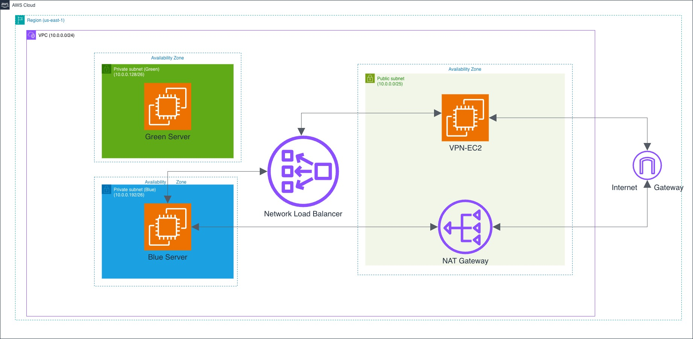
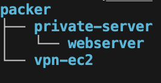
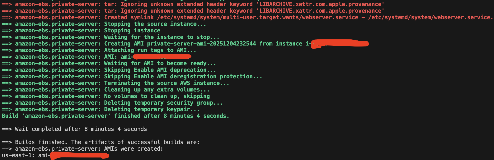
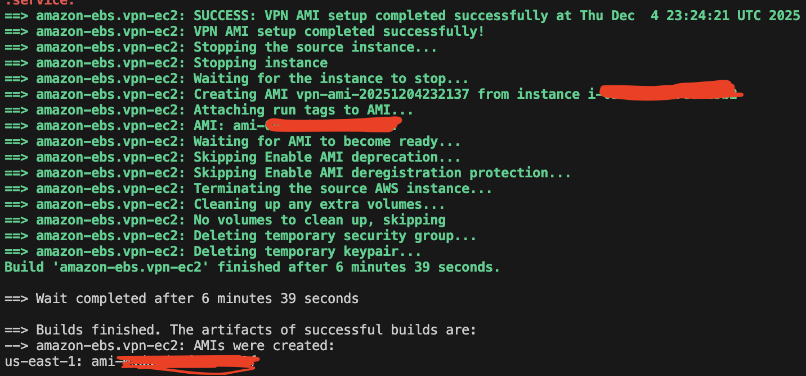
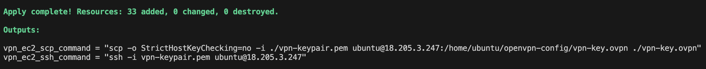
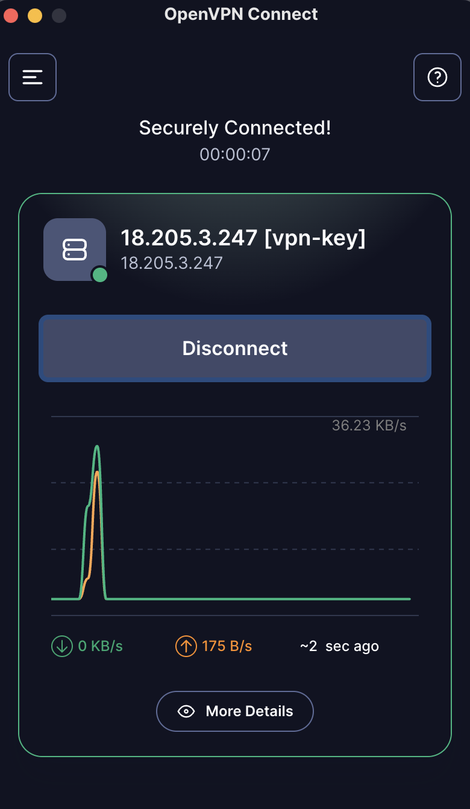
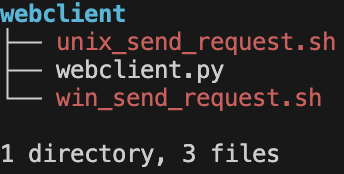
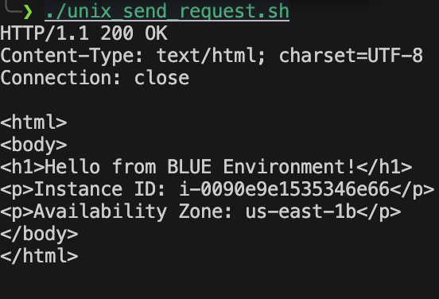
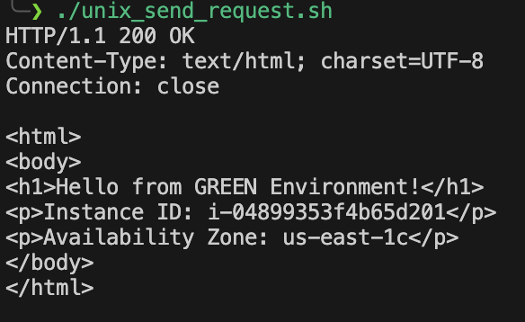
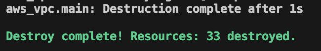

# AWS Virtual Private Cloud Deployer
By:
[Yahya G.](https://www.linkedin.com/in/yahya-guler-ab498a282/)
[Abdirahman H.](https://www.linkedin.com/in/abdirahman-hassan-9864ba2b2/)
[Dustin M.](https://www.linkedin.com/in/dustin-marsh-a3101524a/)
[Paul E.](https://www.linkedin.com/in/paulegbe/)


### **Note**: The terrafrom code currently will only successfully run on Unix Operating Systems (MacOs, Linux) and not Windows. When this issue is resolved, an updated note will be written.

------------------------------------------


### VPC Infrastructure
**This VPC contains 3 subnets**:
**1 public subnet and**
**2 private subnets**

**Public Subnet:**  
An EC2 instance for the VPN, which allows you to connect to the network, and a NAT gateway, which allows internet traffic to and from the private servers

**Private Subnets:**  
2 EC2 instances (blue and green) for the private servers and
a load balancer to properly distribute traffic to the 2 private servers

------------------------------------------
### VPN
The VPN is run with an OpenVPN install. This allows you to connect to the network and interact with the instance's private IP addresses.

### NAT Gateway
The NAT Gateway allows the private servers to access the internet under one public IP address, redirecting incoming traffic to the respective server.

### Private Servers
We have 2 private servers to run blue green deployment, which allows a smooth transition to updated software or a second instance in case of a failure.
A load balancer forwards traffic to the currently running private server.

**Note:** For the purposes of our project, we did not fully implement a Blue/Green deployment strategy. There is no option to rollback to previous versions. Instead, for simplicity's sake, all that is implemented is the switching between the blue and green environments.

------------------------------------------
### Running the VPC
### Step 1: Prerequisites
First, ensure you have correctly installed/set up the following:

-An AWS account and IAM user

-[AWS CLI](https://docs.aws.amazon.com/cli/latest/userguide/getting-started-install.html)

-[Terraform CLI](https://developer.hashicorp.com/terraform/tutorials/aws-get-started/install-cli) 

-[Packer CLI](https://developer.hashicorp.com/packer/tutorials/docker-get-started/get-started-install-cli)

-[OpenVPN](https://openvpn.net/client)

After installing AWS CLI, you will have to configure it by using 
```bash
aws configure
```
You can get your keys in your IAM account in  
*IAM > Users > Security Credentials > Create Access Key*  
While in Users, add the ***AdministratorAccess*** Permissions policies.

------------------------------------------
### Step 2: Running the Packer Files

***Packer Directory:***



After that, navigate into the private-server and vpn-ec2 directories, which are both in the packer directory, and run

```bash
packer init .
```
```bash
packer build .
```

***private-server-ami packer build output:***




***vpn-ami packer build output:***



**Note:** Estimated init + build time: 9 minutes 

**Note:** you can open two terminals and run each packer file in parallel to speed up the process.

------------------------------------------
### Step 3: Running the Terraform Files
After that finished for both folders folder, you can navigate to the terraform directory and run
```bash
terraform init
```

To set Blue environment on, run:
```bash
 terraform apply -var="enable_blue_env=true" -var="enable_green_env=false"
```

To set Green environment on, run:
```bash
terraform apply -var="enable_blue_env=false" -var="enable_green_env=true"
```
type yes and once it finishes you'll be given commands to SSH into the VPN which can be used to SSH into the other instances, and the command to get the .ovpn key.

***terraform apply output:***




**Note:** You must set one environment variable to true and the other environment variable to false. They cannot be both false or both true at the same time.

------------------------------------------
### Step 4: Connecting to the VPC via OpenVPN
After successfully applying the terraform files, the .opvn file from the vpn-ec2 instance should be copied onto your local machine into the terraform directory. 

In your OpenVPN Client GUI, create a new profile by uploading that .opvn then click connect.

***Successful OpenVPN Connection:***




------------------------------------------
### Step 5: Run Test .py File

After successful deployment of the files, the webclient directory should like this:



To test the VPN Connection and the successful deployment of Blue/Green, navigate to the webclient directory, and run one of the .sh script files (whichever works on your machine). 

Both .sh scripts run the same webclient.py file, which sends an http request over a TCP socket on port 8080 over to the Network Load Balancer, which then forwards the request to the private server that is currently running (Blue/Green). The private server should be running a server.py file that is accepting connections and ready to send responses. The response should differ depending on the environment that you set when terraform applying.

The content of ***unix_send_request.sh***:

```bash
#!/usr/bin/env bash
python3 webclient.py <nlb-dns-name> 8080 response.html
```

The content of ***win_send_request.sh***:

```bash
#!/usr/bin/env bash
python webclient.py <nlb-dns-name> 8080 response.html
```


***Respone if Blue Environment is Running:***



***Respone if Green Environment is Running:***



------------------------------------------
### Step 6: Disconnecting from the VPN

Before proceeding to the next step, make sure to disconnect from the VPN in the OpenVPN Client. If you forget to do so, terraform destroy will not run properly. If you run terraform destroy before disconnecting from VPN, wait for the command to fail, disconnect from the VPN, and then run terraform destroy again and it should work properly.


------------------------------------------
### Step 7: Shutting Down the VPC
Once you are done using the VPC, make sure to run
```bash
terraform destroy -var="skip_validation=true"
```
To ensure you don't keep getting charged by AWS

***terraform destroy output:***



--------------------------
