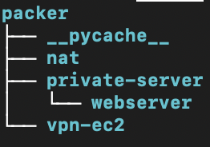

# How to run VPC

## Step 1: Install Terraform CLI. 
Follow the instructions on the HashiCorp website: https://developer.hashicorp.com/terraform/tutorials/aws-get-started/infrastructure-as-code?in=terraform%2Faws-get-started

## Step 2: Create an IAM user in your AWS account and configure it:
You can create an IAM user through the IAM console in your AWS Management Console. Save your user's access key and secret key for the next step.
Useful link: https://docs.aws.amazon.com/IAM/latest/UserGuide/id_users_create.html

Make sure you IAM user is has these permissions allowed:

-AmazonEC2FullAccess


## Step 3: Install the AWS CLI:
Follow the instructions on the aws.com website: https://docs.aws.amazon.com/cli/latest/userguide/getting-started-install.html


## Step 4: Run Packer files:
a-Make sure HCL Packer is installed. Installation guide and link: https://developer.hashicorp.com/packer

b-Enter the packer directory. It should look like this:



There are three main packer directories, which are used to create Machine Images for the EC2 instances in the VPC:
-nat
-private-server
-vpn-ec2

enter each directory and run:

``` bash
packer init .
packer build .
```

The image will take on average 10 minutes to be created, so starting three terminals and running all packer files simultaneously is recommended.

## Step 5: Running the main.tf
In the terraform/ directory, run:
``` bash
terraform init
```
When that is complete, run:

``` bash
terraform apply
```
Type "yes" and Terraform should create the infrastructure in your AWS account, which you can view and access through your AWS Management Console

When done with testing the VPC and you would like to terminate it, run:
``` bash
terraform destroy
```
Type "yes" and Terraform should terminate all resources and instances created.

NOTE: if you forget to run terraform destroy, you will be charged by AWS (albeit pennies)!

 
